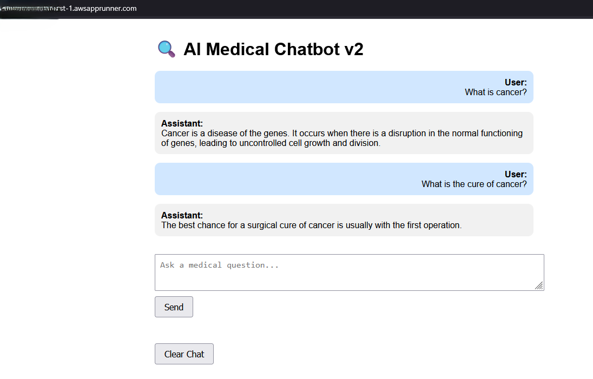
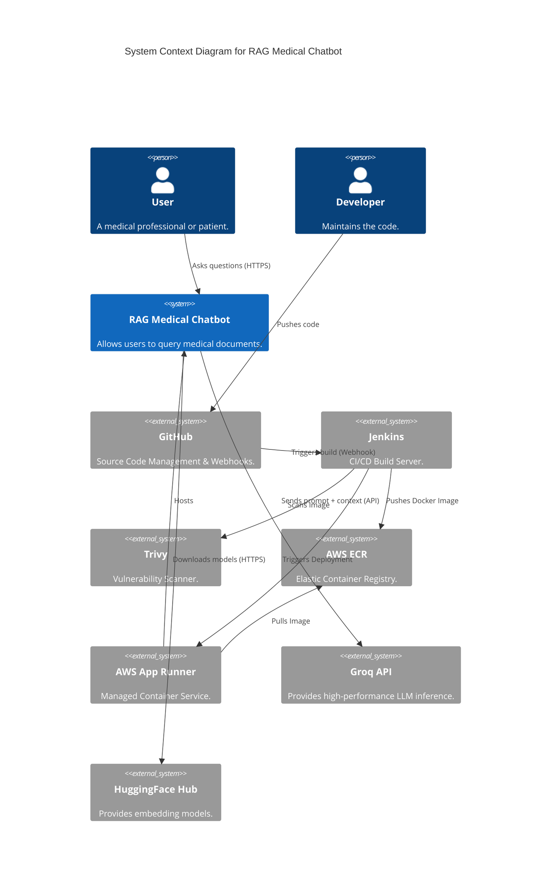
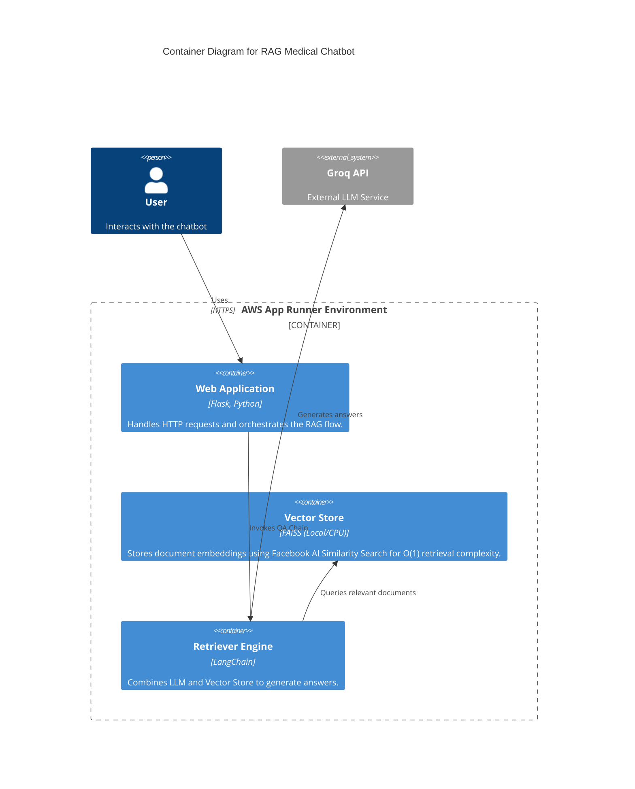
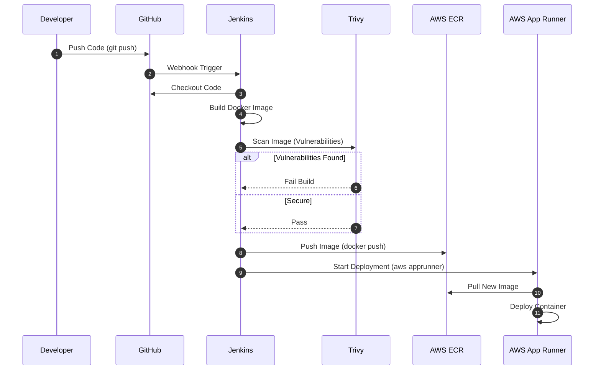
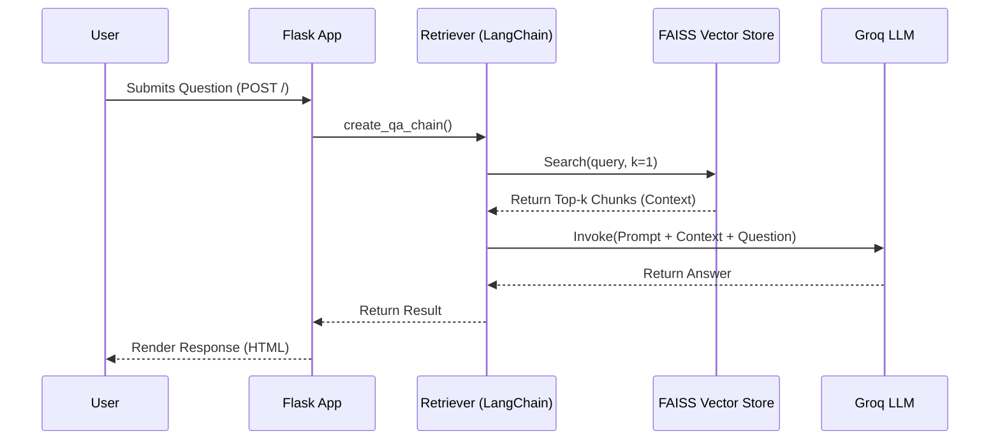

# RAG Medical Chatbot

A Retrieval-Augmented Generation (RAG) chatbot designed to answer medical questions based on provided PDF documentation. This system leverages the **Groq API** for high-speed LLM inference and **FAISS** for efficient vector similarity search.

The project features a complete **CI/CD Pipeline** using **Jenkins**, **Docker**, **Trivy**, **AWS ECR**, and **AWS App Runner** for automated deployment.

## Screenshots


*Figure 1: The interface, where users can input their medical questions and receive answers based on the provided documentation.*


*Figure 2: The system response when no relevant context is found in the documentation.*

## 🏗️ Architecture Overview

The system is built as a web application using **Flask**. It follows a modular architecture where the retrieval logic, LLM integration, and vector storage are decoupled.

## 🧠 Technical Concepts & Architecture

This section provides a deeper look into the system's design, suitable for developers of all levels.

### Core Concepts
*   **RAG (Retrieval-Augmented Generation):** A technique that enhances LLM responses by retrieving relevant data from an external source (our PDF documents) before generating an answer. This reduces hallucinations and provides specific, document-based answers.
*   **Vector Database (FAISS):** We use **Facebook AI Similarity Search** (FAISS) as our vector store. It is a library for efficient similarity search and clustering of dense vectors. In this project, it runs locally on the CPU, storing embeddings of the medical documents.
*   **Embeddings:** We use HuggingFace models to convert text into numerical vectors. Text with similar semantic meaning results in vectors that are mathematically close to each other.
*   **Groq API:** An inference engine that provides extremely fast LLM responses. We use it to generate the final natural language answer based on the context retrieved from FAISS.

### C4 Model - Context Diagram
This diagram shows the system in its environment, including the deployment ecosystem.



### C4 Model - Container Diagram
This diagram shows the high-level containers and technologies used in the runtime environment.



### CI/CD Pipeline Flow (Sequence Diagram)
How the code goes from the developer to production:



### Runtime System Flow (Sequence Diagram)
How a user query is processed:



## � Tech Stack

*   **LLM Integration:** [LangChain](https://www.langchain.com/) - Framework for orchestrating the RAG pipeline.
*   **Vector Database:** [FAISS](https://github.com/facebookresearch/faiss) - Efficient similarity search for dense vectors.
*   **Embeddings:** [HuggingFace](https://huggingface.co/) - Source of the `sentence-transformers` models used for document embedding.
*   **PDF Processing:** [PyPDF](https://pypi.org/project/pypdf/) - Library for loading and parsing PDF documents.
*   **Backend:** [Flask](https://flask.palletsprojects.com/) - Lightweight Python web framework.
*   **Frontend:** HTML5, CSS3 - Simple and responsive user interface.
*   **Containerization:** [Docker](https://www.docker.com/) - Used for creating consistent, portable application environments (Multi-stage builds).
*   **Security:** [Aqua Trivy](https://trivy.dev/) - Comprehensive security scanner for container images.
*   **CI/CD:** [Jenkins](https://www.jenkins.io/) - Automation server for building, testing, and deploying.
*   **Cloud Deployment:** [AWS App Runner](https://aws.amazon.com/apprunner/) - Managed service for running containerized web applications.

## �🚀 Features

*   **High Performance:** Uses Groq API for near-instantaneous LLM responses.
*   **Vector Database (FAISS):** Utilizes Facebook AI Similarity Search (FAISS) for efficient, local dense vector clustering and similarity search. This allows for rapid retrieval of relevant document chunks without external database dependencies.
*   **Custom Prompts:** Tailored medical prompts to ensure concise and accurate answers (2-3 lines).
*   **Dockerized:** Fully containerized with a multi-stage build for a lightweight image (~441MB).
*   **CPU Optimized:** Configured to run efficiently on CPU environments (PyTorch CPU).
*   **Automated Deployment:** Full CI/CD pipeline using Jenkins and AWS.
*   **Secure:** Automated container vulnerability scanning with Trivy.

## 🛠️ Setup & Installation

### Prerequisites
*   **Git:** To clone the repository.
*   **Docker:** For building and running the application container.
*   **Python 3.10+:** (Optional) For local development without Docker.
*   **Groq API Key:** Required for the LLM.
*   **HuggingFace Token:** Required for downloading embedding models.
*   **AWS Account:** (Optional) For ECR & App Runner deployment.

### 1. Clone the Repository
```bash
git clone <repository-url>
cd rag_medical_chatbot
```

### 2. Environment Variables
Create a `.env` file in the root directory:
```env
GROQ_API_KEY=your_groq_api_key_here
HF_TOKEN=your_huggingface_token_here
```

### 3. Initialize Vector Database (Data Ingestion)
**Crucial Step:** Before starting the application, you must process the PDF documents to create the FAISS vector index.

1.  Place your medical PDF documents in the `data/` directory.
2.  Run the data loader script to split the text into chunks and save the embeddings to the `vectorstore/` directory.

```bash
# Ensure you are in the project root and virtual environment is active
python app/components/data_loader.py
```

*   **What this does:** It reads all PDFs in `data/`, creates text chunks (using LangChain), generates embeddings (using HuggingFace models), and saves the index locally to `vectorstore/`.
*   **Note:** If using Docker, run this step *locally* before building the image, so the populated `vectorstore/` is copied into the container. Alternatively, you can run it inside the container.

### 4. Build and Run with Docker (Local)
We use a multi-stage Docker build to keep the image size small.

```bash
# Build the image
docker build -t rag-medical-chatbot .

# Run the container
docker run -p 5000:5000 --env-file .env rag-medical-chatbot
```

Access the application at `http://localhost:5000`.

## 📂 Project Structure

```
rag_medical_chatbot/
├── app/
│   ├── application.py       # Main Flask application entry point
│   ├── components/          # Core logic modules
│   │   ├── retriever.py     # RAG chain orchestration
│   │   ├── llm.py           # LLM initialization (Groq)
│   │   ├── vector_store.py  # FAISS index management
│   │   ├── pdf_loader.py    # Document ingestion
│   │   └── embeddings.py    # Embedding model configuration
│   └── config/              # Configuration settings
├── custom_jenkins/          # Jenkins Docker configuration
│   └── Dockerfile           # Jenkins-DinD image
├── data/                    # PDF documents storage
├── vectorstore/             # Persisted FAISS index
├── requirements.txt         # Python dependencies
├── Dockerfile               # Application Dockerfile
└── Jenkinsfile              # CI/CD Pipeline definition
```

## 🔧 CI/CD Pipeline Setup

This project includes a fully automated CI/CD pipeline.

### 1. Jenkins Setup
The project uses a custom Jenkins Docker image with Docker-in-Docker (DinD) support.

```bash
cd custom_jenkins
docker build -t jenkins-dind .
docker run -d --name jenkins-dind --privileged -p 8080:8080 -p 50000:50000 -v jenkins_home:/var/jenkins_home -v /var/run/docker.sock:/var/run/docker.sock jenkins-dind
```

### 2. Pipeline Configuration
The `Jenkinsfile` defines the following stages:
1.  **Clone:** Pulls code from GitHub.
2.  **Build & Scan:** Builds the Docker image and scans for vulnerabilities using **Trivy**. If vulnerabilities (High/Critical) are found, the build can be configured to fail.
3.  **Push:** Pushes the verified image to **AWS ECR**.
4.  **Deploy:** Triggers a deployment on **AWS App Runner**.

### 3. Required Credentials in Jenkins
*   `github-token`: For accessing the repository.
*   `aws-token`: AWS credentials (Access Key & Secret) for ECR and App Runner access.

## 🔧 Development (Local)

To run locally without Docker:

1.  Create a virtual environment:
    ```bash
    python -m venv venv
    source venv/bin/activate
    ```
2.  Install dependencies (CPU version for torch recommended):
    ```bash
    pip install torch torchvision torchaudio --index-url https://download.pytorch.org/whl/cpu
    pip install -r requirements.txt
    ```
3.  Run the app:
    ```bash
    PYTHONPATH=$PWD python app/application.py
    ```

## Additional information for deployment

## ==> 1. 🚀 Jenkins Setup for Deployment

### 1. Create Jenkins Setup Directory and Dockerfile

- Create a folder named `custom_jenkins`
- Inside `custom_jenkins`, create a `Dockerfile` and add the necessary Jenkins + Docker-in-Docker configuration code

### 2. Build Jenkins Docker Image

Open terminal and navigate to the folder:

```bash
cd custom_jenkins
```

Make sure **Docker Desktop is running in the background**, then build the image:

```bash
docker build -t jenkins-dind .
```

### 3. Run Jenkins Container

```bash
docker run -d ^
  --name jenkins-dind ^
  --privileged ^
  -p 8080:8080 ^
  -p 50000:50000 ^
  -v /var/run/docker.sock:/var/run/docker.sock ^
  -v jenkins_home:/var/jenkins_home ^
  jenkins-dind
```

> ✅ If successful, you’ll get a long alphanumeric container ID

### 4. Check Jenkins Logs and Get Initial Password

```bash
docker ps
docker logs jenkins-dind
```

If the password isn’t visible, run:

```bash
docker exec jenkins-dind cat /var/jenkins_home/secrets/initialAdminPassword
```

### 5. Access Jenkins Dashboard

- Open your browser and go to: [http://localhost:8080](http://localhost:8080)

### 6. Install Python Inside Jenkins Container

Back in the terminal:

```bash
docker exec -u root -it jenkins-dind bash
apt update -y
apt install -y python3
python3 --version
ln -s /usr/bin/python3 /usr/bin/python
python --version
apt install -y python3-pip
exit
```

### 7. Restart Jenkins Container

```bash
docker restart jenkins-dind
```

### 8. Go to Jenkins Dashboard and Sign In Again

## ==> 2. 🔗 Jenkins Integration with GitHub

### 1. Generate a GitHub Personal Access Token

- Go to **GitHub** → **Settings** → **Developer settings** → **Personal access tokens** → **Tokens (classic)**
- Click **Generate new token (classic)**
- Provide:
  - A **name** (e.g., `Jenkins Integration`)
  - Select scopes:
    - `repo` (for full control of private repositories)
    - `admin:repo_hook` (for webhook integration)

- Generate the token and **save it securely** (you won’t see it again!).

> ℹ️ **What is this token?**
> A GitHub token is a secure way to authenticate Jenkins (or any CI/CD tool) to access your GitHub repositories without needing your GitHub password. It's safer and recommended over using plain credentials.

---

### 2. Add GitHub Token to Jenkins Credentials

- Go to **Jenkins Dashboard** → **Manage Jenkins** → **Credentials** → **(Global)** → **Add Credentials**
- Fill in the following:
  - **Username:** Your GitHub username
  - **Password:** Paste the GitHub token you just generated
  - **ID:** `github-token`
  - **Description:** `GitHub Token for Jenkins`

Click **Save**.

---

### 3. Create a New Pipeline Job in Jenkins

- Go back to **Jenkins Dashboard**
- Click **New Item** → Select **Pipeline**
- Enter a name (e.g., `medical-rag-pipeline`)
- Click **OK** → Scroll down, configure minimal settings → Click **Save**

> ⚠️ You will have to configure pipeline details **again** in the next step

---

### 4. Generate Checkout Script from Jenkins UI

- In the left sidebar of your pipeline project, click **Pipeline Syntax**
- From the dropdown, select **`checkout: General SCM`**
- Fill in:
  - SCM: Git
  - Repository URL: Your GitHub repo URL
  - Credentials: Select the `github-token` you just created
- Click **Generate Pipeline Script**
- Copy the generated Groovy script (e.g., `checkout([$class: 'GitSCM', ...])`)

---

### 5. Create a `Jenkinsfile` in Your Repo ( Already done )

- Open your project in **VS Code**
- Create a file named `Jenkinsfile` in the root directory


### 6. Push the Jenkinsfile to GitHub

```bash
git add Jenkinsfile
git commit -m "Add Jenkinsfile for CI pipeline"
git push origin main
```

---

### 7. Trigger the Pipeline

- Go to **Jenkins Dashboard** → Select your pipeline → Click **Build Now**

🎉 **You’ll see a SUCCESS message if everything works!**

✅ **Your GitHub repository has been cloned inside Jenkins’ workspace!**

---

> 🔁 If you already cloned the repo with a `Jenkinsfile` in it, you can skip creating a new one manually.

## ==> 3. 🐳 Build Docker Image, Scan with Trivy, and Push to AWS ECR

### 1. Install Trivy in Jenkins Container

```bash
docker exec -u root -it jenkins bash
apt install -y
curl -LO https://github.com/aquasecurity/trivy/releases/download/v0.62.1/trivy_0.62.1_Linux-64bit.deb
dpkg -i trivy_0.62.1_Linux-64bit.deb
trivy --version
exit
```

Then restart the container:

```bash
docker restart jenkins
```

---

### 2. Install AWS Plugins in Jenkins

- Go to **Jenkins Dashboard** → **Manage Jenkins** → **Plugins**
- Install:
  - **AWS SDK**
  - **AWS Credentials**
- Restart the Jenkins container:

```bash
docker restart jenkins
```

---

### 3. Create IAM User in AWS

- Go to **AWS Console** → **IAM** → **Users** → **Add User**
- Assign **programmatic access**
- Attach policy: `AmazonEC2ContainerRegistryFullAccess`
- After creation, generate **Access Key + Secret**

---

### 4. Add AWS Credentials to Jenkins

- Go to **Jenkins Dashboard** → **Manage Jenkins** → **Credentials**
- Click on **(Global)** → **Add Credentials**
- Select **AWS Credentials**
- Add:
  - **Access Key ID**
  - **Secret Access Key**
- Give an ID (e.g., `aws-ecr-creds`) and Save

---

### 5. Install AWS CLI Inside Jenkins Container

```bash
docker exec -u root -it jenkins-dind bash
apt update
apt install -y unzip curl
curl "https://awscli.amazonaws.com/awscli-exe-linux-x86_64.zip" -o "awscliv2.zip"
unzip awscliv2.zip
./aws/install
aws --version
exit
```

---

### 6. Create an ECR Repository

- Go to AWS Console → ECR → Create Repository
- Note the **repository URI**

---

### 7. Add Build, Scan, and Push Stage in Jenkinsfile (  Already done if cloned )


> 🔐 **Tip**: Change `--exit-code 0` to `--exit-code 1` in Trivy to make the pipeline fail on vulnerabilities.

---

### 8. Fix Docker Daemon Issues (If Any)

If you encounter Docker socket permission issues, fix with:

```bash
docker exec -u root -it jenkins-dind bash
chown root:docker /var/run/docker.sock
chmod 660 /var/run/docker.sock
getent group docker
# If group 'docker' exists, skip next line
usermod -aG docker jenkins
exit

docker restart jenkins-dind
```

Then open **Jenkins Dashboard** again to continue.

## ==> 4. 🚀 Deployment to AWS App Runner

### ✅ Prerequisites

1. **Jenkinsfile Deployment Stage** ( Already done if cloned )

### 🔐 IAM User Permissions

- Go to **AWS Console** → **IAM** → Select your Jenkins user
- Attach the policy: `AWSAppRunnerFullAccess`

---

### 🌐 Setup AWS App Runner (Manual Step)

1. Go to **AWS Console** → **App Runner**
2. Click **Create service**
3. Choose:
   - **Source**: Container registry (ECR)
   - Select your image from ECR
4. Configure runtime, CPU/memory, and environment variables
5. Set auto-deploy from ECR if desired
6. Deploy the service

📺 Follow the tutorial video instructions for correct setup

---

### 🧪 Run Jenkins Pipeline

- Go to **Jenkins Dashboard** → Select your pipeline job
- Click **Build Now**

If all stages succeed (Checkout → Build → Trivy Scan → Push to ECR → Deploy to App Runner):

🎉 **CI/CD Deployment to AWS App Runner is complete!**

✅ Your app is now live and running on AWS 🚀