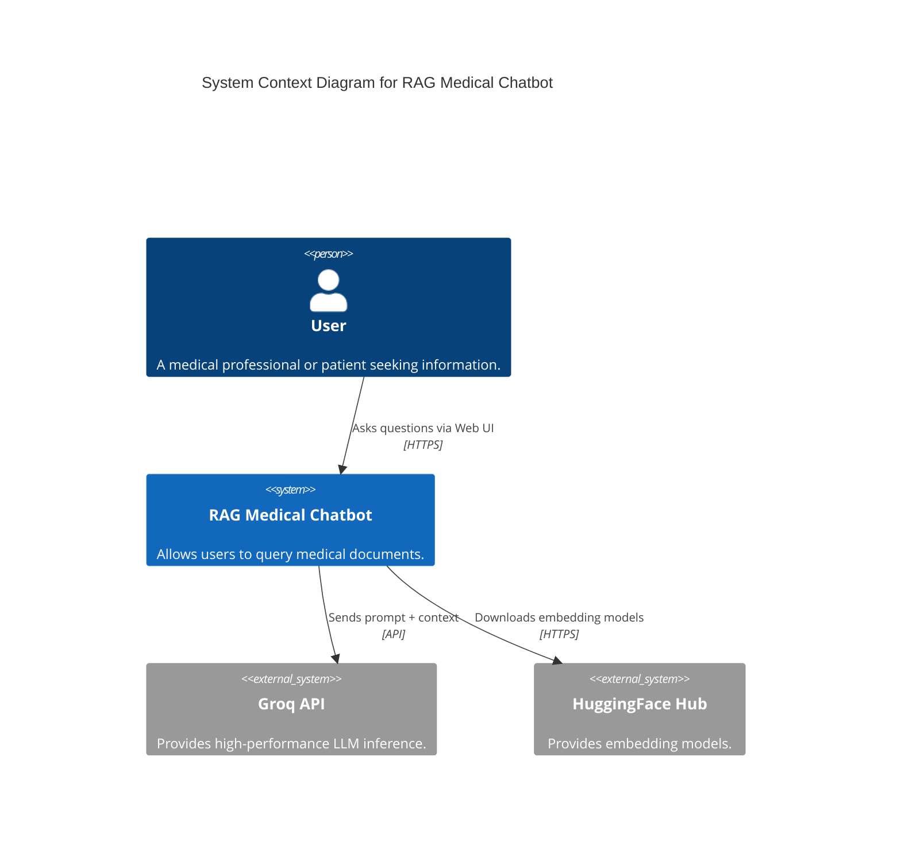
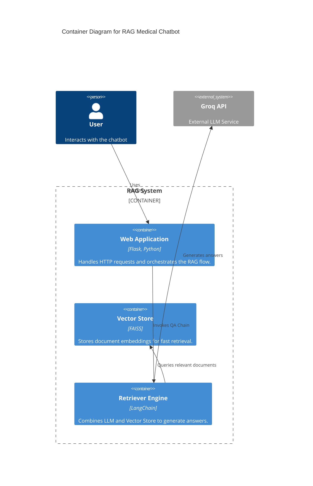
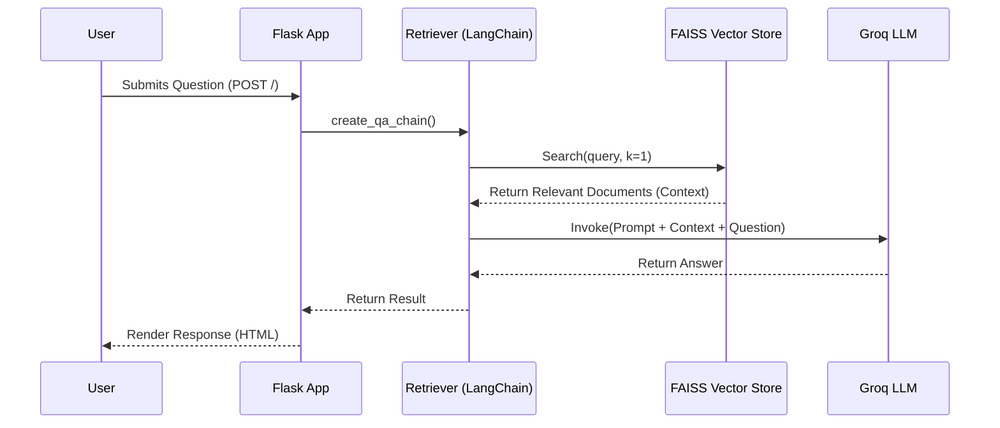

# RAG Medical Chatbot

A Retrieval-Augmented Generation (RAG) chatbot designed to answer medical questions based on provided PDF documentation. This system leverages the **Groq API** for high-speed LLM inference and **FAISS** for efficient vector similarity search.

## 🏗️ Architecture Overview

The system is built as a web application using **Flask**. It follows a modular architecture where the retrieval logic, LLM integration, and vector storage are decoupled.

### C4 Model - Context Diagram
This diagram shows the system in its environment.



### C4 Model - Container Diagram
This diagram shows the high-level containers and technologies used.



### System Flow (Sequence Diagram)
How a user query is processed:



## 🚀 Features

*   **High Performance:** Uses Groq API for near-instantaneous LLM responses.
*   **Local Vector Store:** Uses FAISS CPU for efficient, local similarity search.
*   **Custom Prompts:** Tailored medical prompts to ensure concise and accurate answers (2-3 lines).
*   **Dockerized:** Fully containerized with a multi-stage build for a lightweight image (~441MB).
*   **CPU Optimized:** configured to run efficiently on CPU environments (PyTorch CPU).

## 🛠️ Setup & Installation

### Prerequisites
*   Docker
*   Groq API Key
*   HuggingFace Token (optional, for accessing gated models if needed)

### 1. Clone the Repository
```bash
git clone <repository-url>
cd rag_medical_chatbot
```

### 2. Environment Variables
Create a `.env` file in the root directory:
```env
GROQ_API_KEY=your_groq_api_key_here
HF_TOKEN=your_huggingface_token_here
```

### 3. Build and Run with Docker
We use a multi-stage Docker build to keep the image size small.

```bash
# Build the image
docker build -t rag-medical-chatbot:optimized .

# Run the container
docker run -p 5000:5000 --env-file .env rag-medical-chatbot:optimized
```

Access the application at `http://localhost:5000`.

## 📂 Project Structure

```
rag_medical_chatbot/
├── app/
│   ├── application.py       # Main Flask application entry point
│   ├── components/          # Core logic modules
│   │   ├── retriever.py     # RAG chain orchestration
│   │   ├── llm.py           # LLM initialization (Groq)
│   │   ├── vector_store.py  # FAISS index management
│   │   ├── pdf_loader.py    # Document ingestion
│   │   └── embeddings.py    # Embedding model configuration
│   └── config/              # Configuration settings
├── data/                    # PDF documents storage
├── vectorstore/             # Persisted FAISS index
├── requirements.txt         # Python dependencies
└── Dockerfile               # Multi-stage Docker configuration
```

## 🔧 Development

To run locally without Docker:

1.  Create a virtual environment:
    ```bash
    python -m venv venv
    source venv/bin/activate
    ```
2.  Install dependencies (CPU version for torch recommended):
    ```bash
    pip install torch torchvision torchaudio --index-url https://download.pytorch.org/whl/cpu
    pip install -r requirements.txt
    ```
3.  Run the app:
    ```bash
    python app/application.py
    ```

## ✅ Prerequisites Checklist (Complete These Before Moving Forward)
- [ ] **Docker Desktop** is installed and running in the background
- [ ] **Code versioning** is properly set up using GitHub (webhook repository pushed and updated)
- [ ] **Dockerfile** is created and configured for the project
- [ ] **Dockerfile** is also created and configured for **Jenkins**

## ==> 1. 🚀 Jenkins Setup for Deployment

### 1. Create Jenkins Setup Directory and Dockerfile

- Create a folder named `custom_jenkins`
- Inside `custom_jenkins`, create a `Dockerfile` and add the necessary Jenkins + Docker-in-Docker configuration code

### 2. Build Jenkins Docker Image

Open terminal and navigate to the folder:

```bash
cd custom_jenkins
```

Make sure **Docker Desktop is running in the background**, then build the image:

```bash
docker build -t jenkins-dind .
```
### 3. Run Jenkins Container

```bash
docker run -d \
  --name jenkins \
  --privileged \
  -p 8080:8080 \
  -p 50000:50000 \
  -v jenkins_home:/var/jenkins_home \
  -v /var/run/docker.sock:/var/run/docker.sock \
  jenkins-dind
```

> ✅ If successful, you’ll get a long alphanumeric container ID

### 4. Check Jenkins Logs and Get Initial Password

```bash
docker ps
docker logs jenkins
```

If the password isn’t visible, run:

```bash
docker exec jenkins cat /var/jenkins_home/secrets/initialAdminPassword
```

### 5. Access Jenkins Dashboard

- Open your browser and go to: [http://localhost:8080](http://localhost:8080)

### 6. Install Python Inside Jenkins Container

Back in the terminal:

```bash
docker exec -u root -it jenkins bash
apt update -y
apt install -y python3
python3 --version
ln -s /usr/bin/python3 /usr/bin/python
python --version
apt install -y python3-pip
exit
```

### 7. Restart Jenkins Container

```bash
docker restart jenkins
```